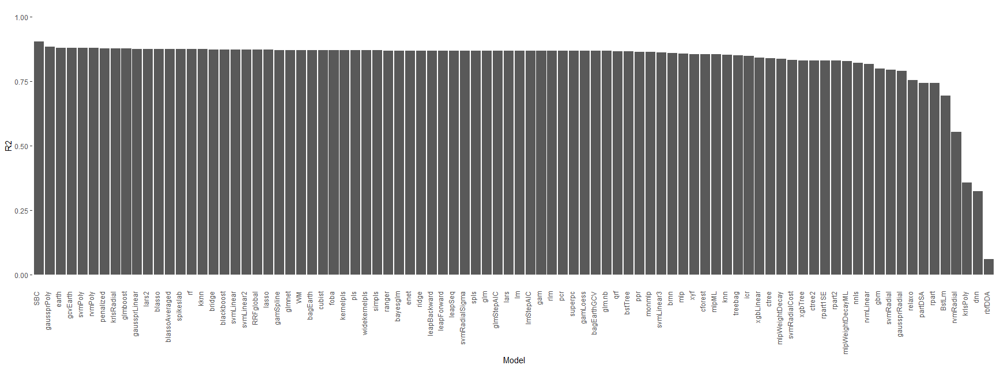

# Caret Model Evaluation


Archived R utilities for comparing many `caret` models against a supervised learning target.

This repository is preserved as earlier statistical ML work. It is useful as a compact example of programmatically iterating through `caret` model families, recording model performance, and comparing results. It is not actively maintained.

## What it does

The `caret` package provides a common interface across many classification and regression models. This repo explores a simple question: instead of choosing a model family by hand, can we iterate across available `caret` models and compare performance in a consistent way?

The core function is implemented in:

| File | Purpose |
|---|---|
| `R/caretmodeleval.R` | Runs model evaluation across available `caret` models with timeout handling. |
| `DESCRIPTION` | Minimal R package metadata. |
| `irislength.png` | Example output plot from the iris dataset. |

## Historical usage

Install from GitHub:

```r
library(devtools)
install_github("codychampion/Caret-Model-Evaluation")
```

Install `caret` with its suggested dependencies:

```r
install.packages(
  "caret",
  repos = "http://cran.r-project.org",
  dependencies = c("Depends", "Imports", "Suggests")
)
```

Example:

```r
library(datasets)

data(iris)
target <- "Sepal.Length"
modeleval(target, iris, timeouttime = 60)
```

## Example output

The original example evaluates models for `Sepal.Length` prediction on the iris dataset and plots model performance by `R2`.



## Limitations

- This is archived research/learning code, not a maintained package.
- The timeout workflow was written for Linux and may not work on Windows.
- `caret` model availability depends on local package installation and optional dependencies.
- Results should be treated as exploratory model-screening output, not final statistical validation.
